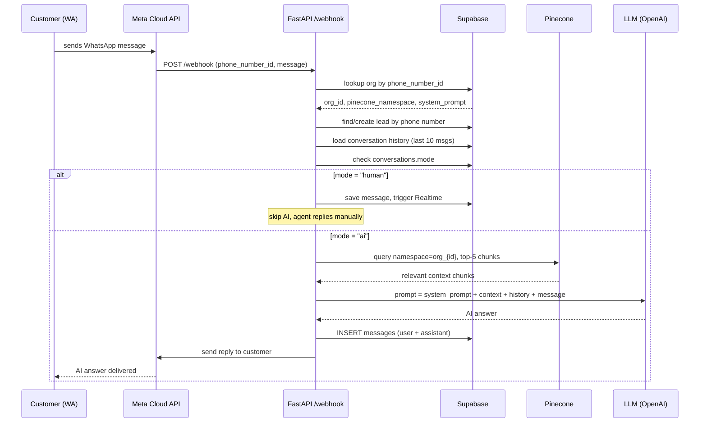
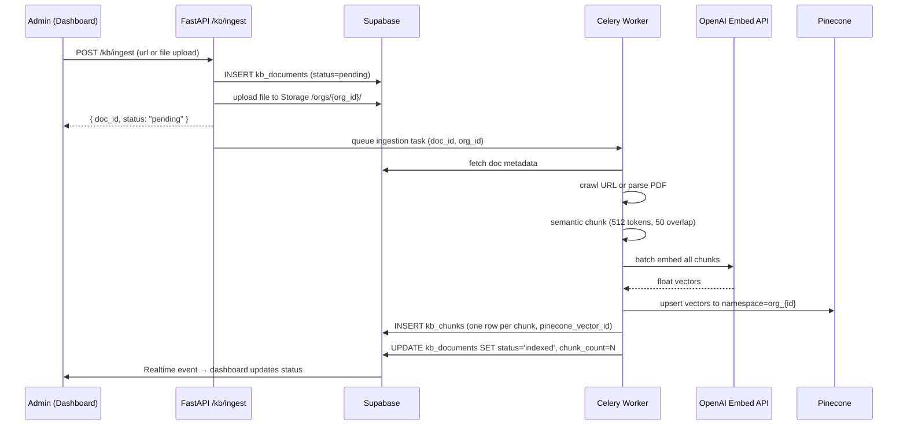
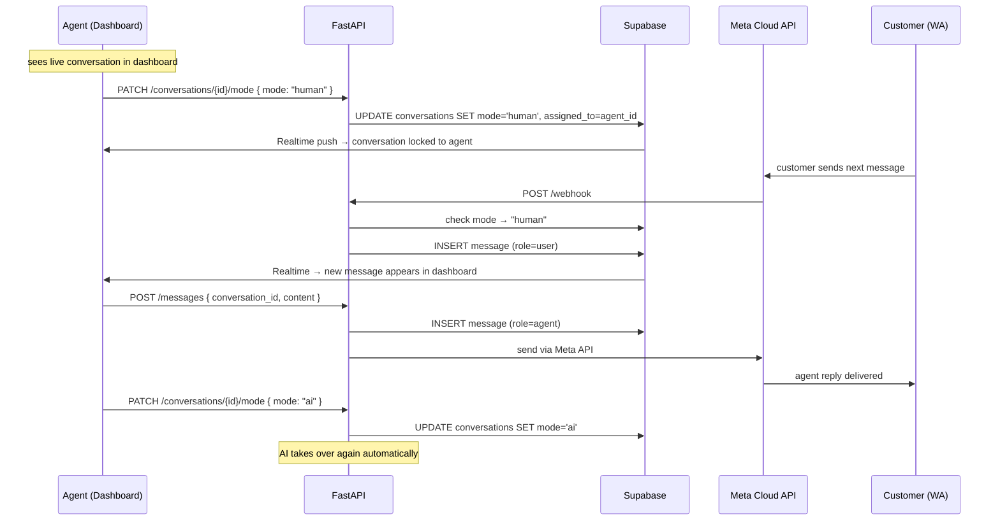

# ARCHITECTURE.md — Dealership AI Full System Design

## System Overview

```
┌─────────────────────────────────────────────────────────────────────┐
│                         CLIENTS                                      │
│  📱 WhatsApp User          🖥  Dealer Dashboard (Next.js)           │
└────────────┬───────────────────────────┬────────────────────────────┘
             │ Meta Cloud API webhook     │ REST + Supabase Realtime
             ▼                           ▼
┌─────────────────────────────────────────────────────────────────────┐
│                      FASTAPI BACKEND                                 │
│                                                                      │
│  /webhook ──► Org Resolver ──► Mode Check (ai/human)                │
│                                    │              │                  │
│                               RAG Service    Takeover Svc           │
│                                    │              │                  │
│                          Lead Classifier    Notify Service          │
│                                                                      │
│  /kb/ingest ──► [Celery Worker] ──► Chunk ──► Embed ──► Upsert     │
└──────┬────────────────────┬─────────────────────┬───────────────────┘
       │                    │                     │
       ▼                    ▼                     ▼
┌─────────────┐   ┌──────────────────┐   ┌──────────────┐
│  Supabase   │   │    Pinecone       │   │  Meta Cloud  │
│  Postgres   │   │  Vector Index     │   │     API      │
│             │   │                  │   │              │
│ orgs        │   │ namespace per    │   │ send reply   │
│ users       │   │ org_{uuid}       │   │ to WA user   │
│ leads       │   │                  │   │              │
│ convs       │◄──► kb_chunks        │   └──────────────┘
│ messages    │   │ (vector_id FK)   │
│ kb_docs     │   └──────────────────┘
│ kb_chunks   │
│ notifs      │
└─────────────┘
```

---

## Layer Responsibilities

### 1. Meta Cloud API (WhatsApp)
- Receives customer messages, sends them to your `/webhook`
- You call it back to send replies to the customer
- One `phone_number_id` maps to one dealership org

### 2. FastAPI Backend
Every request starts here. Key responsibilities:

| Service | File | Does |
|---------|------|------|
| Webhook Router | `routes/webhook.py` | Resolves org, checks mode, dispatches |
| RAG Service | `services/retrieval.py` | Embed → Pinecone → LLM → answer |
| Ingest Service | `services/ingestion.py` | URL/PDF → chunks → Pinecone |
| Lead Classifier | `services/lead_classifier.py` | Detects hot/warm/cold intent |
| Takeover Service | `services/takeover.py` | Flips `conversations.mode` |
| Notify Service | `services/notify.py` | Pushes alerts to dashboard + WA |

### 3. Supabase (Postgres)
**All structured business data.** Row Level Security enforces per-org isolation at the database layer — no application code can accidentally leak data between orgs.

### 4. Pinecone (Vector DB)
**AI knowledge only.** One index, one namespace per org (`org_{uuid}`). Stores embeddings of chunked documents. Never stores raw text — that stays in `kb_chunks` table in Supabase.

### 5. Dealer Dashboard (Next.js)
- Connects to FastAPI for actions (ingest, takeover, send message)
- Connects to Supabase Realtime for live updates (new leads, incoming messages)

---

## Data Flow Diagrams

### A. WhatsApp Chat Flow



### B. Knowledge Base Ingestion Flow



### C. Human Takeover Flow



---

## Environment Variables

```env
# FastAPI
SECRET_KEY=

# Supabase
SUPABASE_URL=
SUPABASE_SERVICE_KEY=         # server-side only, never expose to client
SUPABASE_ANON_KEY=

# Pinecone
PINECONE_API_KEY=
PINECONE_INDEX_NAME=dealership-ai

# OpenAI
OPENAI_API_KEY=

# Meta WhatsApp
META_VERIFY_TOKEN=            # for webhook verification
META_APP_SECRET=
META_API_VERSION=v19.0

# Redis (Upstash)
REDIS_URL=
```